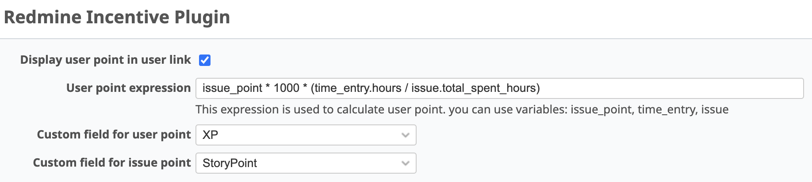
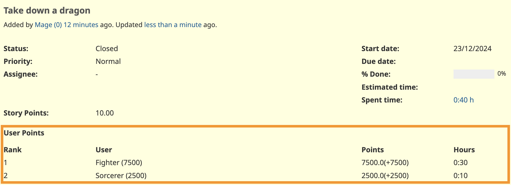

# Redmine Incentive Plugin

Simple incentive system with custom fields and time log.

* Set Issue Points
* Log time on Issue
* When the Issue is closing, all contributed users get points.

# Tested redmine version

| plugin version | tested redmine version |
|----------------|------------------------|
| 0.1.0          | 3.2.3, 3.4.4           |
| 1.0.0          | 6.0.2, 6.0.1, 5.1.5    |

# Install

To install this plugin, follow the general [Redmine's Plugin installation](https://www.redmine.org/projects/redmine/wiki/Plugins#Installing-a-plugin)

* clone this project to user redmine's plugins directory
* run `rake redmine:plugins:migrate`

# Configuration

After installation, you have to configure the plugin.
Find the plugin in the plugin list and click the Configure link.

[Settings screen]

You have to create two Custom Fields.

* Issue Points
  * float or int type
  * This value is given by Human. A team have to make some rule to set this value, like using planning poker.
* User Points
  * float or int type
  * default is 0
  * this is auto-calculated value by this plugin.
  * Better set this field as read-only.

Finally, you have to set those Custom Fields in the Plugin's configuration.

## User points expression

* You can set the expression to calculate points for each user when the issue is closing.
* The default expression is `issue_point * 1000 * (time_entry.hours / issue.total_spent_hours)`
  This means that user will get share of Issue Points by ratio of time log.
* Issue Point is distributed to each user each time the issue is closing.
* If issue is re-opening, a User Point is recalled.

# Screens

[User points details in issue detail screen]

